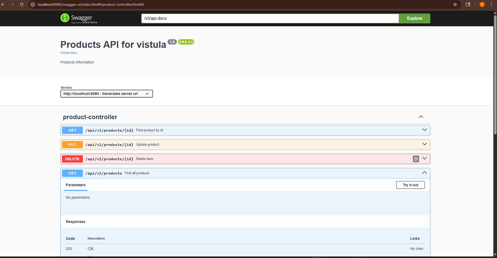

# Overview

This project is part of Exercise 16 of our Spring Framework practice series. In Task 2, we develop a basic Java application using the Spring Framework with annotations for dependency injection and configuration. This task introduces the use of @Component, @Autowired, and Spring's annotation-based configuration.

# Features

Demonstrates the use of:

1. @Component for bean declaration

2. @Autowired for automatic dependency injection

3. @ComponentScan and @Configuration for setting up Spring context

4. Clean and minimal setup with no XML configuration

5. Simple Java classes (MessageService, MessagePrinter) wired using Spring annotations

# Created 

ProductNotFoundException and global handler with @ControllerAdvice.

Returned clean error responses instead of 500s.

Documented and Tested with Swagger

Added springdoc-openapi-ui to pom.xml.

Accessed interactive UI at /swagger-ui/index.html.

Connected to a Real Database

Switched to H2 in-memory DB with JPA and annotations like @Entity, @Id.
Added PUT and DELETE functionality

Enabled full CRUD operations using HTTP methods
Tested with Postman, Swagger, and browser

# Requirements

Java 8 or higher

Maven or Gradle for build automation (or compile manually with javac)

Spring Framework (context module)
Key Spring Concepts Used
@Component: Marks classes as Spring-managed components.

@Autowired: Injects dependencies automatically.

@ComponentScan: Scans specified package for annotated components.

AnnotationConfigApplicationContext: Initializes Spring context with Java configuration.

